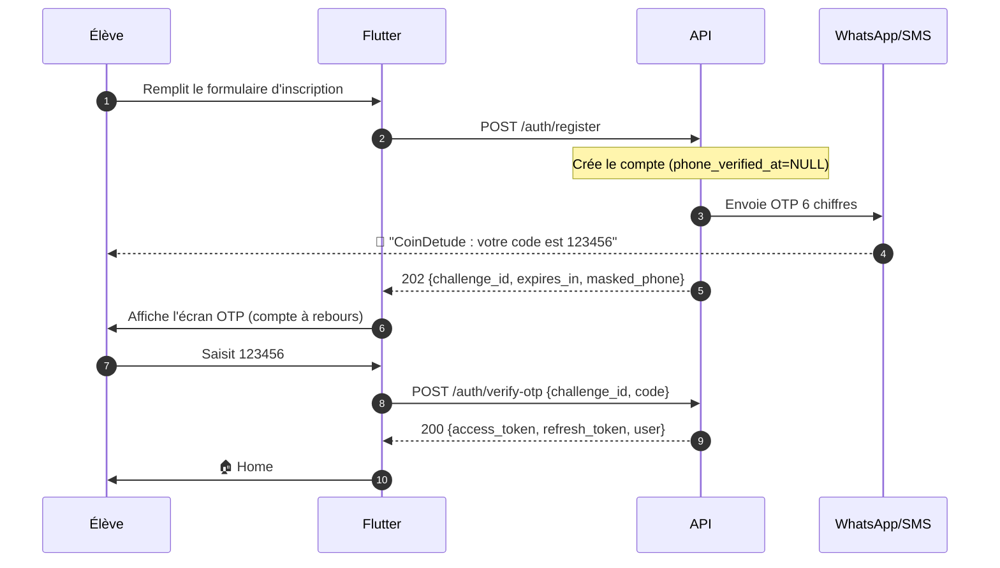
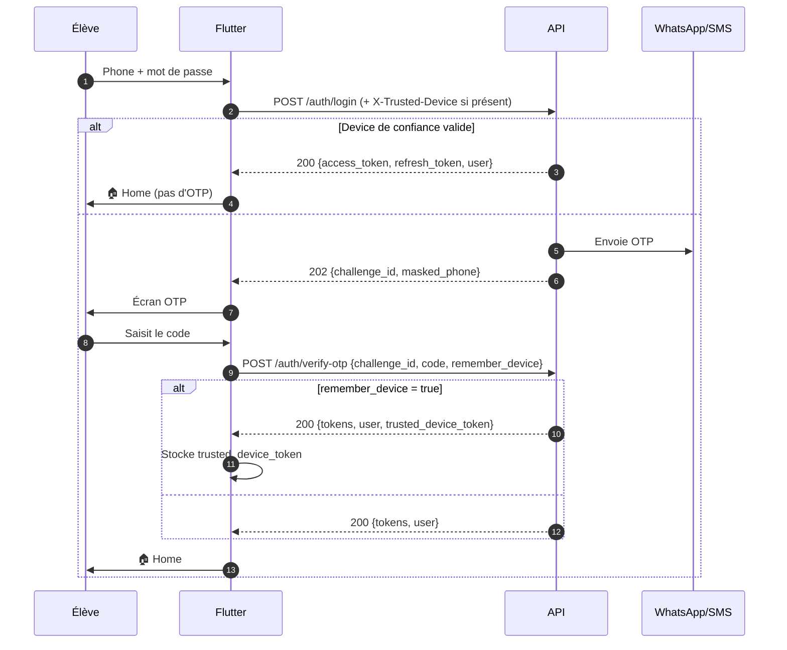
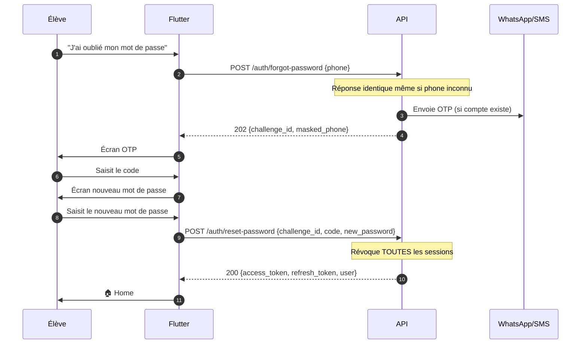
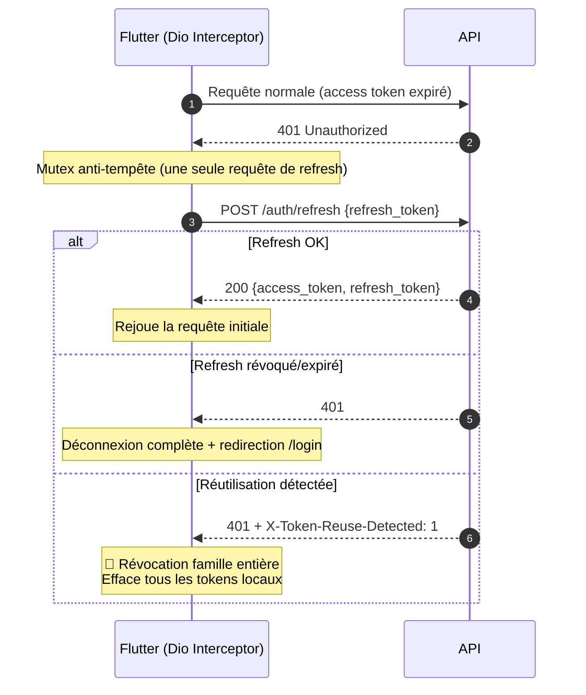

# 📘 Document d'intégration — Module Authentification CoinDetude

**Version** : 1.0
**Date** : 2026-09-19
**Cible** : Développeurs Flutter du projet CoinDetude
**Backend** : FastAPI — préfixe `/api/v1`
**Statut** : Contrat figé — à respecter strictement

---

## 📑 Table des matières

1. [Vue d'ensemble](#1-vue-densemble)
2. [Conventions globales](#2-conventions-globales)
3. [Architecture des flows](#3-architecture-des-flows)
4. [Endpoints détaillés](#4-endpoints-détaillés)
5. [Codes d'erreur](#5-codes-derreur)
6. [Rate limiting](#6-rate-limiting)
7. [Gestion des tokens](#7-gestion-des-tokens)
8. [Trusted device](#8-trusted-device)
9. [Implémentation Flutter](#9-implémentation-flutter)
10. [Cas limites et troubleshooting](#10-cas-limites-et-troubleshooting)

---

## 1. Vue d'ensemble

### 1.1. Principe

L'authentification CoinDetude repose sur un **double facteur léger** :

1. **Facteur 1** : mot de passe (ce que l'utilisateur connaît)
2. **Facteur 2** : code OTP à 6 chiffres reçu par WhatsApp (ou SMS en fallback) — ce que l'utilisateur possède

**Aucun token n'est émis avant validation du code OTP.** Le mot de passe seul ne suffit jamais à obtenir une session.

### 1.2. Canaux OTP

| Canal | Priorité | Fallback |
|---|---|---|
| **WhatsApp** | Primaire | Bascule SMS automatique si échec |
| **SMS** | Secondaire | — |

### 1.3. Types de tokens

| Token | Format | Durée | Révocable | Stockage client |
|---|---|---|---|---|
| **Access token** | JWT HS256 | 15 min | ❌ (stateless) | Mémoire vive |
| **Refresh token** | Opaque (32 octets base64url) | 30 jours | ✅ | Stockage sécurisé |
| **Trusted device token** | Opaque (32 octets base64url) | 30 jours | ✅ | Stockage sécurisé |

### 1.4. Les 3 flows supportés

| Flow | Déclencheur | Résultat |
|---|---|---|
| **Register** | Nouvel élève | Vérification phone + session |
| **Login** | Élève existant | Vérification phone + session |
| **Reset password** | Mot de passe oublié | Nouveau mot de passe + session |

---

## 2. Conventions globales

### 2.1. URL de base

```
Production : https://api.coindetude.tg/api/v1
Staging    : https://staging-api.coindetude.tg/api/v1
Dev local  : http://10.0.2.2:8000/api/v1   (émulateur Android)
           : http://localhost:8000/api/v1  (iOS simulator)
```

### 2.2. Headers standards

| Header | Requis | Description |
|---|---|---|
| `Content-Type` | Oui (POST/PUT) | `application/json` |
| `Accept` | Oui | `application/json` |
| `Authorization` | Sur routes protégées | `Bearer <access_token>` |
| `X-Refresh-Token` | Optionnel | Alternative au body pour `/auth/refresh` |
| `X-Trusted-Device` | Optionnel | Sur `/auth/login` pour skip OTP |
| `X-Client-Version` | Recommandé | Version de l'app (analytics + force update) |
| `Accept-Language` | Optionnel | `fr-FR` (locale cible) |

### 2.3. Format de réponse standard

**Succès** : JSON avec les données métier.

**Erreur** (RFC 7807 simplifié) :
```json
{
  "detail": "Message lisible par l'utilisateur",
  "code": "machine_readable_code",
  "context": { }
}
```

Le champ `detail` est **directement affichable** à l'élève (ton tutoiement, français simple).

### 2.4. Codes HTTP utilisés

| Code | Signification |
|---|---|
| `200` | Succès |
| `202` | Accepté (OTP envoyé, en attente de vérification) |
| `204` | Succès sans contenu (logout) |
| `400` | Requête malformée |
| `401` | Authentification requise / invalide |
| `403` | Accès refusé (compte suspendu, phone non vérifié) |
| `404` | Ressource introuvable |
| `409` | Conflit (phone déjà utilisé) |
| `410` | Gone (OTP consommé) |
| `422` | Erreur de validation |
| `429` | Trop de requêtes (rate limit) |
| `500` | Erreur serveur |

### 2.5. Locale et fuseaux

- Toutes les dates sont en **UTC ISO 8601** avec timezone (`2026-09-19T14:32:11.123Z`).
- Le client doit convertir en heure locale pour l'affichage.

---

## 3. Architecture des flows

### 3.1. Flow complet — Inscription



### 3.2. Flow complet — Connexion



### 3.3. Flow complet — Mot de passe oublié



### 3.4. Flow — Refresh token (silencieux)



---

## 4. Endpoints détaillés

### 4.1. `POST /auth/register` — Étape 1 inscription

**Description** : Crée un compte (ou met à jour un compte non vérifié existant) et envoie un OTP par WhatsApp.

**Auth** : aucune.

**Request** :
```json
{
  "first_name": "Kofi",
  "last_name": "Amegan",
  "phone": "+22890123456",
  "email": "kofi@example.tg",
  "password": "Sekret123",
  "role": "student"
}
```

| Champ | Type | Requis | Contrainte |
|---|---|---|---|
| `first_name` | string | ✅ | 1-100 caractères |
| `last_name` | string | ✅ | 1-100 caractères |
| `phone` | string | ✅ | Format E.164 (`+228XXXXXXXX`) |
| `email` | string | ❌ | Email valide |
| `password` | string | ✅ | 8-128 chars, ≥1 lettre + ≥1 chiffre |
| `role` | enum | ❌ | `student` (défaut), `parent`, `teacher` |

**Response 202** :
```json
{
  "challenge_id": "a1b2c3d4-e5f6-7890-abcd-ef1234567890",
  "expires_in": 300,
  "channel": "whatsapp",
  "masked_phone": "+228****56",
  "dev_code": null
}
```

> **`dev_code`** : uniquement rempli en environnement de dev/staging. En production, toujours `null`. Utile pour automatiser les tests.

**Erreurs** :

| Code | `detail` | Cause |
|---|---|---|
| `409` | "Un compte existe déjà avec ce numéro." | Phone déjà vérifié |
| `422` | "Le mot de passe doit contenir au moins un chiffre" | Validation Pydantic |
| `429` | "Rate limit dépassé, retry dans Xs" | Trop d'envois OTP |

**Notes** :
- Si le phone existe mais **non vérifié**, le compte est mis à jour (nouveau mot de passe, nouveau profil) et un nouvel OTP est envoyé. Le client reçoit un nouveau `challenge_id`.
- Les anciens OTP actifs pour ce `(phone, register)` sont invalidés automatiquement.

---

### 4.2. `POST /auth/login` — Étape 1 connexion

**Description** : Vérifie le mot de passe et envoie un OTP. **Ou** retourne directement les tokens si un device de confiance est fourni.

**Auth** : aucune.

**Request** :
```json
{
  "phone": "+22890123456",
  "password": "Sekret123"
}
```

**Headers optionnels** :
```
X-Trusted-Device: <trusted_device_token>
```

**Response A — 202 (OTP envoyé)** :
```json
{
  "challenge_id": "b2c3d4e5-f6a7-8901-bcde-f23456789012",
  "expires_in": 300,
  "channel": "whatsapp",
  "masked_phone": "+228****56",
  "dev_code": null
}
```

**Response B — 200 (device de confiance valide)** :
```json
{
  "access_token": "eyJhbGc...",
  "refresh_token": "xr8_Kj2mNp...",
  "token_type": "bearer",
  "expires_in": 900,
  "user": { ... },
  "trusted_device_token": null
}
```

> ⚠️ **Important** : le client doit distinguer ces deux réponses par le **code HTTP** (`202` vs `200`), pas par la présence d'un champ.

**Erreurs** :

| Code | `detail` | Cause |
|---|---|---|
| `401` | "Téléphone ou mot de passe incorrect." | User inexistant OU mauvais password |
| `403` | "Compte suspendu." | `is_active=false` |
| `403` | "Numéro non vérifié. Utilisez /auth/resend-otp." | `phone_verified_at=NULL` |
| `429` | "Rate limit dépassé" | > 5 tentatives / 15 min |

**Sécurité côté serveur** : le serveur fait un **temps de réponse constant** (~100 ms), que le user existe ou non. Impossible d'énumérer les comptes par timing.

---

### 4.3. `POST /auth/verify-otp` — Étape 2 (register ou login)

**Description** : Vérifie le code OTP et émet les tokens. Endpoint **commun** à register et login.

**Auth** : aucune.

**Request** :
```json
{
  "challenge_id": "a1b2c3d4-e5f6-7890-abcd-ef1234567890",
  "code": "123456",
  "remember_device": false
}
```

| Champ | Type | Requis | Contrainte |
|---|---|---|---|
| `challenge_id` | UUID | ✅ | Retourné par register/login |
| `code` | string | ✅ | 6 chiffres exactement |
| `remember_device` | boolean | ❌ | Défaut `false` |

**Response 200** :
```json
{
  "access_token": "eyJhbGc...",
  "refresh_token": "xr8_Kj2mNp...",
  "token_type": "bearer",
  "expires_in": 900,
  "user": {
    "id": "uuid",
    "first_name": "Kofi",
    "last_name": "Amegan",
    "phone": "+22890123456",
    "email": "kofi@example.tg",
    "role": "student",
    "is_active": true,
    "phone_verified_at": "2026-09-19T14:30:00Z"
  },
  "trusted_device_token": "td_Kj8mNp..." | null
}
```

> **`trusted_device_token`** : présent uniquement si `remember_device=true`. À stocker dans le stockage sécurisé.

**Erreurs** :

| Code | `detail` | Cause |
|---|---|---|
| `401` | "Code incorrect." | Mauvais code (attempts incrémenté) |
| `410` | "Ce code a déjà été utilisé." | OTP déjà consommé |
| `410` | "Ce code a expiré." | TTL dépassé |
| `429` | "Trop de tentatives sur ce code." | 5 tentatives atteintes |
| `400` | "Challenge invalide." | `challenge_id` inconnu |

**Comportement clé** :
- Après succès, le challenge est marqué `consumed_at=now()` → **un seul usage**.
- Une nouvelle famille de refresh tokens est créée.
- Le compteur de rate limit login est remis à zéro.

---

### 4.4. `POST /auth/forgot-password` — Étape 1 reset

**Description** : Envoie un OTP de réinitialisation.

**Auth** : aucune.

**Request** :
```json
{ "phone": "+22890123456" }
```

**Response 202** :
```json
{
  "challenge_id": "c3d4e5f6-a7b8-9012-cdef-345678901234",
  "expires_in": 600,
  "channel": "whatsapp",
  "masked_phone": "+228****56",
  "dev_code": null
}
```

> **Anti-énumération** : la réponse est **identique** que le compte existe ou non. Le serveur crée un OTP "fantôme" (`user_id=null`) pour les phones inconnus.

**Erreurs** :

| Code | Cause |
|---|---|
| `429` | Rate limit dépassé |
| `422` | Format de phone invalide |

**TTL** : 600 secondes (10 min) — plus long que register/login (l'élève peut être distrait).

---

### 4.5. `POST /auth/reset-password` — Étape 2 reset

**Description** : Vérifie l'OTP, change le mot de passe, révoque toutes les sessions existantes, émet une nouvelle paire de tokens.

**Auth** : aucune.

**Request** :
```json
{
  "challenge_id": "c3d4e5f6-a7b8-9012-cdef-345678901234",
  "code": "123456",
  "new_password": "NouveauSekret456"
}
```

**Response 200** : identique à `/verify-otp` (tokens + user).

**Erreurs** : idem `/verify-otp`, plus :

| Code | Cause |
|---|---|
| `400` | "Ce challenge n'est pas destiné à un reset password." | Mauvais `purpose` |
| `404` | "Utilisateur introuvable." | OTP fantôme (phone inconnu) |

**Effets de bord** :
- **Toutes** les familles de refresh tokens de l'utilisateur sont révoquées.
- **Tous** les trusted devices sont révoqués.
- `phone_verified_at` est mis à jour si nécessaire.

> ⚠️ Le client doit **effacer** ses anciens refresh tokens et trusted device après un reset.

---

### 4.6. `POST /auth/resend-otp` — Renvoi

**Description** : Invalide l'OTP actuel et en émet un nouveau pour le même `(phone, purpose)`.

**Auth** : aucune (basé sur le `challenge_id`).

**Request** :
```json
{ "challenge_id": "a1b2c3d4-..." }
```

**Response 202** :
```json
{
  "challenge_id": "d4e5f6a7-b8c9-0123-def4-567890123456",
  "expires_in": 300,
  "channel": "whatsapp",
  "masked_phone": "+228****56",
  "dev_code": null
}
```

> **Nouveau `challenge_id`** : l'ancien est invalidé. Le client doit mettre à jour son état.

**Erreurs** :

| Code | Cause |
|---|---|
| `400` | Challenge inconnu |
| `429` | Rate limit (3 / 15 min, 10 / jour) |

**UX recommandée** : compte à rebours de 60 s côté client avant d'autoriser le bouton "Renvoyer".

---

### 4.7. `POST /auth/refresh` — Rotation

**Description** : Échange un refresh token contre une nouvelle paire.

**Auth** : aucune (le refresh token fait office d'authentification).

**Request (option 1 — body)** :
```json
{ "refresh_token": "xr8_Kj2mNp..." }
```

**Request (option 2 — header)** :
```
POST /api/v1/auth/refresh
X-Refresh-Token: xr8_Kj2mNp...
```

**Response 200** :
```json
{
  "access_token": "eyJhbGc...",
  "refresh_token": "NOUVEAU_token...",
  "token_type": "bearer",
  "expires_in": 900
}
```

> ⚠️ Le `refresh_token` est **à usage unique**. Le client doit **remplacer** son ancien token par le nouveau. Utiliser l'ancien déclenche une **détection de réutilisation**.

**Fenêtre de grâce (30 s)** : si le client retente avec l'ancien token **dans les 30 secondes** suivant le premier refresh (perte réseau, retry automatique), le serveur retourne **la même réponse** sans rien changer. Aucune sanction.

**Erreurs** :

| Code | Header | Cause |
|---|---|---|
| `401` | — | Token inconnu ou expiré |
| `401` | `X-Token-Reuse-Detected: 1` | **Réutilisation détectée** → famille entière révoquée |

**Comportement client attendu** :
- Sur `401` simple → déconnexion (session expirée).
- Sur `401` + `X-Token-Reuse-Detected` → **effacement total** de tous les tokens locaux + message "Pour ta sécurité, reconnecte-toi".

---

### 4.8. `POST /auth/logout` — Déconnexion d'un appareil

**Description** : Révoque le refresh token courant.

**Auth** : `Bearer <access_token>` **et** `refresh_token` dans le body.

**Request** :
```json
{ "refresh_token": "xr8_Kj2mNp..." }
```

**Response 204** : aucun contenu.

**Erreurs** : `422` si `refresh_token` absent.

---

### 4.9. `POST /auth/logout-all` — Déconnexion globale

**Description** : Révoque toutes les familles de refresh tokens et tous les trusted devices.

**Auth** : `Bearer <access_token>` requis.

**Request** : aucun body.

**Response 204** : aucun contenu.

---

## 5. Codes d'erreur

### 5.1. Table complète des `detail`

| `detail` | Code HTTP | Signification |
|---|---|---|
| "Téléphone ou mot de passe incorrect." | 401 | Mauvais credentials (générique) |
| "Compte suspendu." | 403 | `is_active=false` |
| "Numéro non vérifié. Utilisez /auth/resend-otp." | 403 | `phone_verified_at=NULL` |
| "Code incorrect." | 401 | Mauvais OTP |
| "Ce code a expiré." | 410 | TTL dépassé |
| "Ce code a déjà été utilisé." | 410 | OTP consommé |
| "Trop de tentatives sur ce code." | 429 | 5 tentatives atteintes |
| "Challenge inconnu." | 400 | `challenge_id` inexistant |
| "Un compte existe déjà avec ce numéro." | 409 | Phone déjà vérifié |
| "Rate limit dépassé, retry dans Xs" | 429 | Trop d'appels |
| "Refresh token inconnu." | 401 | Token jamais émis |
| "Refresh token expiré." | 401 | TTL dépassé |
| "Refresh token déjà utilisé. Toute la famille a été révoquée par mesure de sécurité." | 401 | Réutilisation |

### 5.2. Mapping UX recommandé

| `detail` | Écran Flutter |
|---|---|
| "Téléphone ou mot de passe incorrect." | Toast rouge sur le formulaire |
| "Numéro non vérifié." | Redirection vers l'écran OTP avec message |
| "Code incorrect." | Shake animation + compteur de tentatives |
| "Ce code a expiré." | Bouton "Renvoyer le code" mis en avant |
| "Trop de tentatives." | Blocage temporaire, message "Attends X minutes" |
| "Rate limit dépassé, retry dans Xs" | Compte à rebours basé sur `Retry-After` |
| "Compte suspendu." | Écran de contact support |

---

## 6. Rate limiting

### 6.1. Quotas côté serveur

| Action | Limite | Fenêtre |
|---|---|---|
| Envoi OTP par phone | 3 | 15 min |
| Envoi OTP par phone (jour) | 10 | 24 h |
| Envoi OTP par IP | 20 | 1 h |
| Tentatives login par phone | 5 | 15 min |
| Tentatives OTP par challenge | 5 | — |

### 6.2. Comportement sur `429`

Le serveur retourne :
```
HTTP/1.1 429 Too Many Requests
Retry-After: 45
```

**Le client doit** :
1. Lire `Retry-After` (secondes).
2. Afficher un compte à rebours visuel.
3. **Désactiver** le bouton concerné pendant ce délai.

### 6.3. Anti-spam côté client (en plus)

Le client doit **aussi** appliquer un compte à rebours local de **60 secondes** sur :
- Le bouton "Renvoyer le code" (`/auth/resend-otp`).
- Le bouton "Renvoyer" après une erreur.

Cela évite de consommer le quota serveur pour rien.

---

## 7. Gestion des tokens

### 7.1. Stockage côté client

| Token | Emplacement | Durée de vie |
|---|---|---|
| `access_token` | **Mémoire vive uniquement** (variable Dart) | 15 min |
| `refresh_token` | `flutter_secure_storage` (Keychain/Keystore) | 30 jours |
| `trusted_device_token` | `flutter_secure_storage` | 30 jours |

> ⚠️ **Ne jamais** stocker l'`access_token` dans `SharedPreferences` ou sur disque. Sa durée de vie est courte, il doit être perdu à la fermeture de l'app.

### 7.2. Cycle de vie

```
App ouvre
  └─> Lecture refresh_token + trusted_device_token depuis secure storage
      └─> Si présents :
            - (Option A) Refresh immédiat pour obtenir un access token
            - (Option B) Attendre la 1ère requête API (interceptor 401)
          Sinon → Écran /login
```

### 7.3. Mutex anti-tempête

Si 5 requêtes API partent en parallèle et que l'access token est expiré, **une seule** requête de refresh doit être lancée. Les 4 autres attendent sa résolution puis rejouent leur requête initiale.

**Implémentation recommandée** :
```dart
class TokenRefreshMutex {
  Completer<String>? _refreshing;

  Future<String> refresh() async {
    if (_refreshing != null) return _refreshing!.future;
    _refreshing = Completer<String>();
    try {
      final newToken = await _doRefresh();
      _refreshing!.complete(newToken);
      return newToken;
    } catch (e) {
      _refreshing!.completeError(e);
      rethrow;
    } finally {
      _refreshing = null;
    }
  }
}
```

---

## 8. Trusted device

### 8.1. Principe

Le trusted device permet de **skipper l'OTP** au login pendant 30 jours, sur un appareil donné.

### 8.2. Émission

À `/auth/verify-otp`, si `remember_device=true`, la réponse contient :
```json
{ "trusted_device_token": "td_Kj8mNp...", ... }
```

Le client **doit** :
1. Stocker ce token dans `flutter_secure_storage`.
2. L'envoyer dans le header `X-Trusted-Device` à chaque `/auth/login`.

### 8.3. Révocation

Le trusted device est révoqué automatiquement dans les cas suivants :
- `/auth/logout-all` est appelé.
- `/auth/reset-password` est appelé.
- 30 jours se sont écoulés depuis l'émission.
- L'utilisateur change de mot de passe via un autre moyen.

### 8.4. UX

**Proposition** : case à cocher "Se souvenir de moi sur cet appareil" sur l'écran de saisie OTP.

Texte : *"Ne plus me demander de code sur cet appareil pendant 30 jours"*.

---

## 9. Implémentation Flutter

### 9.1. Modèles Dart

```dart
// lib/features/auth/data/models/auth_models.dart

import 'package:freezed_annotation/freezed_annotation.dart';

part 'auth_models.freezed.dart';
part 'auth_models.g.dart';

@freezed
class UserRead with _$UserRead {
  const factory UserRead({
    required String id,
    required String firstName,
    required String lastName,
    required String phone,
    String? email,
    required String role,
    required bool isActive,
    String? phoneVerifiedAt,
  }) = _UserRead;

  factory UserRead.fromJson(Map<String, dynamic> json) =>
      _$UserReadFromJson(json);
}

@freezed
class OTPSentResponse with _$OTPSentResponse {
  const factory OTPSentResponse({
    required String challengeId,
    required int expiresIn,
    required String channel,
    required String maskedPhone,
    String? devCode,
  }) = _OTPSentResponse;

  factory OTPSentResponse.fromJson(Map<String, dynamic> json) =>
      _$OTPSentResponseFromJson(json);
}

@freezed
class AuthResponse with _$AuthResponse {
  const factory AuthResponse({
    required String accessToken,
    required String refreshToken,
    @Default('bearer') String tokenType,
    required int expiresIn,
    required UserRead user,
    String? trustedDeviceToken,
  }) = _AuthResponse;

  factory AuthResponse.fromJson(Map<String, dynamic> json) =>
      _$AuthResponseFromJson(json);
}

@freezed
class TokenPair with _$TokenPair {
  const factory TokenPair({
    required String accessToken,
    required String refreshToken,
    @Default('bearer') String tokenType,
    required int expiresIn,
  }) = _TokenPair;

  factory TokenPair.fromJson(Map<String, dynamic> json) =>
      _$TokenPairFromJson(json);
}

// Erreurs typées
@freezed
class ApiError with _$ApiError {
  const factory ApiError({
    required int statusCode,
    required String detail,
    String? code,
    Map<String, dynamic>? context,
  }) = _ApiError;
}
```

### 9.2. Repository

```dart
// lib/features/auth/data/auth_repository.dart

class AuthRepository {
  final Dio _dio;
  final FlutterSecureStorage _storage;

  AuthRepository(this._dio, this._storage);

  static const _kRefreshToken = 'refresh_token';
  static const _kTrustedDevice = 'trusted_device_token';

  // --- Stockage sécurisé ---

  Future<void> _saveRefreshToken(String token) =>
      _storage.write(key: _kRefreshToken, value: token);

  Future<String?> getRefreshToken() => _storage.read(key: _kRefreshToken);

  Future<void> _saveTrustedDevice(String token) =>
      _storage.write(key: _kTrustedDevice, value: token);

  Future<String?> getTrustedDevice() => _storage.read(key: _kTrustedDevice);

  Future<void> clearAll() async {
    await _storage.delete(key: _kRefreshToken);
    await _storage.delete(key: _kTrustedDevice);
  }

  // --- Étape 1 ---

  Future<OTPSentResponse> register({
    required String firstName,
    required String lastName,
    required String phone,
    String? email,
    required String password,
  }) async {
    final resp = await _dio.post('/auth/register', data: {
      'first_name': firstName,
      'last_name': lastName,
      'phone': phone,
      if (email != null) 'email': email,
      'password': password,
    });
    return OTPSentResponse.fromJson(resp.data);
  }

  /// Retourne soit OTPSentResponse (202), soit AuthResponse (200).
  Future<dynamic> login({
    required String phone,
    required String password,
  }) async {
    final trusted = await getTrustedDevice();
    final resp = await _dio.post(
      '/auth/login',
      data: {'phone': phone, 'password': password},
      options: Options(
        headers: {if (trusted != null) 'X-Trusted-Device': trusted},
        validateStatus: (s) => s == 200 || s == 202,
      ),
    );
    if (resp.statusCode == 200) {
      final auth = AuthResponse.fromJson(resp.data);
      await _saveRefreshToken(auth.refreshToken);
      return auth;
    }
    return OTPSentResponse.fromJson(resp.data);
  }

  // --- Étape 2 ---

  Future<AuthResponse> verifyOtp({
    required String challengeId,
    required String code,
    bool rememberDevice = false,
  }) async {
    final resp = await _dio.post('/auth/verify-otp', data: {
      'challenge_id': challengeId,
      'code': code,
      'remember_device': rememberDevice,
    });
    final auth = AuthResponse.fromJson(resp.data);
    await _saveRefreshToken(auth.refreshToken);
    if (auth.trustedDeviceToken != null) {
      await _saveTrustedDevice(auth.trustedDeviceToken!);
    }
    return auth;
  }

  // --- Forgot / Reset ---

  Future<OTPSentResponse> forgotPassword({required String phone}) async {
    final resp = await _dio.post(
      '/auth/forgot-password',
      data: {'phone': phone},
    );
    return OTPSentResponse.fromJson(resp.data);
  }

  Future<AuthResponse> resetPassword({
    required String challengeId,
    required String code,
    required String newPassword,
  }) async {
    final resp = await _dio.post('/auth/reset-password', data: {
      'challenge_id': challengeId,
      'code': code,
      'new_password': newPassword,
    });
    final auth = AuthResponse.fromJson(resp.data);
    // Reset : on efface tout puis on stocke le nouveau refresh
    await clearAll();
    await _saveRefreshToken(auth.refreshToken);
    return auth;
  }

  Future<OTPSentResponse> resendOtp({required String challengeId}) async {
    final resp = await _dio.post(
      '/auth/resend-otp',
      data: {'challenge_id': challengeId},
    );
    return OTPSentResponse.fromJson(resp.data);
  }

  // --- Refresh ---

  Future<TokenPair> refresh() async {
    final refreshToken = await getRefreshToken();
    if (refreshToken == null) {
      throw const UnauthorizedException('Aucun refresh token');
    }
    final resp = await _dio.post('/auth/refresh', data: {
      'refresh_token': refreshToken,
    });
    final tokens = TokenPair.fromJson(resp.data);
    await _saveRefreshToken(tokens.refreshToken);
    return tokens;
  }

  // --- Logout ---

  Future<void> logout() async {
    final refreshToken = await getRefreshToken();
    if (refreshToken != null) {
      try {
        await _dio.post('/auth/logout', data: {
          'refresh_token': refreshToken,
        });
      } catch (_) {
        // Silencieux : on efface quand même localement
      }
    }
    await clearAll();
  }

  Future<void> logoutAll() async {
    try {
      await _dio.post('/auth/logout-all');
    } catch (_) {}
    await clearAll();
  }
}
```

### 9.3. Intercepteur Dio — Auth + 401 Mutex

```dart
// lib/core/network/auth_interceptor.dart

class AuthInterceptor extends Interceptor {
  final AuthRepository _authRepo;
  final Dio _dio;
  final Completer<String>? _refreshing = null;
  String? _accessToken; // mémoire vive uniquement

  AuthInterceptor(this._authRepo, this._dio);

  String? get accessToken => _accessToken;

  @override
  void onRequest(
    RequestOptions options,
    RequestInterceptorHandler handler,
  ) {
    // Ne pas ajouter le Bearer sur les routes d'auth publiques
    final isAuthRoute = options.path.startsWith('/auth/');
    if (!isAuthRoute && _accessToken != null) {
      options.headers['Authorization'] = 'Bearer $_accessToken';
    }
    options.headers['X-Client-Version'] = appVersion;
    options.headers['Accept-Language'] = 'fr-FR';
    handler.next(options);
  }

  @override
  Future<void> onError(
    DioException err,
    ErrorInterceptorHandler handler,
  ) async {
    if (err.response?.statusCode != 401) {
      return handler.next(err);
    }

    // Détection de réutilisation de refresh token
    if (err.response?.headers.value('x-token-reuse-detected') == '1') {
      await _authRepo.clearAll();
      _accessToken = null;
      return handler.next(err); // La couche UI redirigera vers /login
    }

    final isRefreshRoute = err.requestOptions.path == '/auth/refresh';
    if (isRefreshRoute) {
      // Le refresh lui-même a échoué → déconnexion
      await _authRepo.clearAll();
      _accessToken = null;
      return handler.next(err);
    }

    // Mutex : une seule requête de refresh
    try {
      final newToken = await _refreshWithMutex();
      // Rejouer la requête initiale
      final clone = await _dio.request(
        err.requestOptions.path,
        data: err.requestOptions.data,
        queryParameters: err.requestOptions.queryParameters,
        options: Options(
          method: err.requestOptions.method,
          headers: {
            ...err.requestOptions.headers,
            'Authorization': 'Bearer $newToken',
          },
        ),
      );
      return handler.resolve(clone);
    } catch (_) {
      await _authRepo.clearAll();
      _accessToken = null;
      return handler.next(err);
    }
  }

  Future<String> _refreshWithMutex() async {
    // Si un refresh est en cours, attendre sa fin
    // (implémentation simple : à remplacer par un vrai mutex)
    final tokens = await _authRepo.refresh();
    _accessToken = tokens.accessToken;
    return tokens.accessToken;
  }

  void setAccessToken(String token) => _accessToken = token;
}
```

### 9.4. Providers Riverpod

```dart
// lib/features/auth/application/auth_providers.dart

final authRepositoryProvider = Provider<AuthRepository>((ref) {
  final dio = ref.watch(dioProvider);
  return AuthRepository(dio, const FlutterSecureStorage());
});

final authInterceptorProvider = Provider<AuthInterceptor>((ref) {
  final dio = ref.watch(dioProvider);
  final repo = ref.watch(authRepositoryProvider);
  return AuthInterceptor(repo, dio);
});

final currentUserProvider = StateProvider<UserRead?>((ref) => null);

// Controller pour l'écran de login
final loginControllerProvider =
    AsyncNotifierProvider.autoDispose<LoginController, LoginState>(
  LoginController.new,
);

class LoginController extends AutoDisposeAsyncNotifier<LoginState> {
  @override
  Future<LoginState> build() async => const LoginState.initial();

  Future<void> submit({required String phone, required String password}) async {
    state = const AsyncLoading();
    try {
      final repo = ref.read(authRepositoryProvider);
      final result = await repo.login(phone: phone, password: password);
      if (result is AuthResponse) {
        // Device de confiance → connecté directement
        ref.read(authInterceptorProvider).setAccessToken(result.accessToken);
        ref.read(currentUserProvider.notifier).state = result.user;
        state = AsyncData(LoginState.authenticated(result.user));
      } else if (result is OTPSentResponse) {
        // OTP requis
        state = AsyncData(LoginState.otpRequired(result));
      }
    } on DioException catch (e) {
      state = AsyncError(_mapError(e), StackTrace.current);
    }
  }
}

sealed class LoginState {
  const LoginState();
  const factory LoginState.initial() = _Initial;
  const factory LoginState.otpRequired(OTPSentResponse otp) = _OTPRequired;
  const factory LoginState.authenticated(UserRead user) = _Authenticated;
}
```

### 9.5. Gestion des erreurs

```dart
// lib/core/network/error_mapper.dart

String mapApiErrorToMessage(DioException e) {
  final status = e.response?.statusCode;
  final detail = e.response?.data?['detail'] as String?;

  if (status == 429) {
    final retryAfter = e.response?.headers.value('retry-after');
    if (retryAfter != null) {
      return "Trop de tentatives. Réessaie dans ${retryAfter}s.";
    }
    return detail ?? "Trop de tentatives. Réessaie plus tard.";
  }

  if (detail != null) return detail;

  switch (status) {
    case 401: return "Session expirée. Reconnecte-toi.";
    case 403: return "Accès refusé.";
    case 404: return "Ressource introuvable.";
    case 500: return "Erreur serveur. Réessaie plus tard.";
    default:  return "Une erreur est survenue.";
  }
}
```

### 9.6. Écrans recommandés

| Écran | Route | Description |
|---|---|---|
| `SplashScreen` | `/` | Redirection intelligente |
| `WelcomeScreen` | `/welcome` | Onboarding 3 écrans |
| `RegisterScreen` | `/register` | Formulaire d'inscription |
| `LoginScreen` | `/login` | Formulaire de connexion |
| `OTPScreen` | `/otp` | Saisie code + compte à rebours |
| `ForgotPasswordScreen` | `/forgot-password` | Saisie phone |
| `ResetPasswordScreen` | `/reset-password` | Nouveau mot de passe |
| `HomeScreen` | `/home` | Post-login |

**Navigation GoRouter** :
```dart
GoRouter(
  redirect: (context, state) {
    final isAuth = ref.read(currentUserProvider) != null;
    final isAuthRoute = state.matchedLocation.startsWith('/auth') ||
                        state.matchedLocation == '/login' ||
                        state.matchedLocation == '/register';
    if (!isAuth && !isAuthRoute) return '/login';
    if (isAuth && isAuthRoute) return '/home';
    return null;
  },
  routes: [ /* ... */ ],
);
```

---

## 10. Cas limites et troubleshooting

### 10.1. « Aucun code reçu »

**Cause possible** : WhatsApp indisponible → fallback SMS (automatique côté serveur).

**Client** :
1. Attendre 60 s.
2. Afficher "Renvoyer le code".
3. Si toujours rien après 5 min → proposer "Utiliser SMS" (déclenche un `/resend-otp` avec un header optionnel `Prefer-Channel: sms`, si implémenté).

### 10.2. « J'ai perdu mon `challenge_id` »

Le client **doit** persister le `challenge_id` dans son state local (Riverpod) tant que l'écran OTP est actif. Si l'app est fermée, l'utilisateur doit refaire `/register` ou `/login`.

### 10.3. « L'app crash au refresh »

**Cause fréquente** : plusieurs requêtes 401 simultanées → plusieurs refresh en parallèle → détection de réutilisation.

**Solution** : implémenter correctement le `TokenRefreshMutex` (§7.3). Un seul refresh doit être en vol à la fois.

### 10.4. « Mon refresh token est révoqué sans raison »

**Causes possibles** :
- Une requête en arrière-plan a refreshé, puis le foreground a réutilisé l'ancien token hors fenêtre de grâce → détection de réutilisation.
- L'utilisateur a fait `/reset-password` ailleurs → toutes les sessions révoquées.
- L'utilisateur a fait `/logout-all` sur un autre appareil.

**Comportement attendu** : déconnexion propre + message "Pour ta sécurité, reconnecte-toi".

### 10.5. Mode dev — code dans la réponse

En dev/staging, la réponse contient `dev_code`. **Ne jamais logger ce champ en production**. Le backend retourne `null` en production.

### 10.6. Test avec le backend local

Si tu utilises l'émulateur Android :
```
Base URL = http://10.0.2.2:8000/api/v1
```
`10.0.2.2` est l'alias de `localhost` de la machine hôte vu depuis l'émulateur.

Sur iOS Simulator : `http://localhost:8000/api/v1` fonctionne directement.

### 10.7. Locale `fr_FR.UTF-8`

Toutes les chaînes côté serveur sont en français, tutoiement. Ne pas traduire côté client (le client peut surcharger en cas de besoin).

### 10.8. Erreur 422

Le format d'erreur Pydantic standard est :
```json
{
  "detail": [
    {
      "loc": ["body", "password"],
      "msg": "Le mot de passe doit contenir au moins un chiffre",
      "type": "value_error"
    }
  ]
}
```

⚠️ **Différent** du format d'erreur standard (`detail` string). Le client doit gérer les deux cas :
```dart
String extractDetail(dynamic data) {
  if (data is Map && data['detail'] is String) return data['detail'];
  if (data is Map && data['detail'] is List) {
    final first = (data['detail'] as List).first;
    return first['msg'] ?? 'Erreur de validation';
  }
  return 'Erreur inconnue';
}
```

---

## 📎 Annexes

### A. Tableau récapitulatif des endpoints

| Méthode | Endpoint | Auth | Body | Réponse |
|---|---|---|---|---|
| POST | `/auth/register` | ❌ | RegisterRequest | 202 OTPSentResponse |
| POST | `/auth/login` | ❌ | LoginRequest | 202 OTPSentResponse **ou** 200 AuthResponse |
| POST | `/auth/verify-otp` | ❌ | VerifyOTPRequest | 200 AuthResponse |
| POST | `/auth/forgot-password` | ❌ | ForgotPasswordRequest | 202 OTPSentResponse |
| POST | `/auth/reset-password` | ❌ | ResetPasswordRequest | 200 AuthResponse |
| POST | `/auth/resend-otp` | ❌ | ResendOTPRequest | 202 OTPSentResponse |
| POST | `/auth/refresh` | ❌ | RefreshRequest | 200 TokenPair |
| POST | `/auth/logout` | ✅ | RefreshRequest | 204 |
| POST | `/auth/logout-all` | ✅ | — | 204 |

### B. Variables de configuration Flutter

```dart
// lib/core/config/env.dart
class Env {
  static const apiBaseUrl = String.fromEnvironment(
    'API_BASE_URL',
    defaultValue: 'http://10.0.2.2:8000/api/v1',
  );
  static const appVersion = '1.2.0';
}
```

Lance avec :
```bash
flutter run --dart-define=API_BASE_URL=https://api.coindetude.tg/api/v1
```

### C. Checklist d'intégration

- [ ] Modèles Dart (Freezed) créés
- [ ] `AuthRepository` implémenté avec `flutter_secure_storage`
- [ ] Intercepteur Dio (Auth + 401 Mutex)
- [ ] Providers Riverpod (repo, interceptor, controllers)
- [ ] Écrans : Register, Login, OTP, Forgot, Reset
- [ ] Redirection GoRouter basée sur l'état d'auth
- [ ] Gestion `dev_code` (uniquement en dev)
- [ ] Compte à rebours sur "Renvoyer le code" (60 s)
- [ ] Lecture de `Retry-After` sur 429
- [ ] Détection du header `X-Token-Reuse-Detected`
- [ ] Case à cocher "Se souvenir de cet appareil"
- [ ] Tests widget sur les flows critiques
- [ ] Logs (PostHog) : `login_started`, `login_otp_sent`, `login_success`, `login_failed`, `logout`

### D. Contacts

| Rôle | Nom | Contact |
|---|---|---|
| Responsable projet | M. TIASSOU K.M. Sylvain | tiassousylvain6120@gmail.com |
| Backend | — | — |
| Frontend Flutter | — | — |

---

**Fin du document — v1.0**

---

Veux-tu que je te livre maintenant **L7** (`/sync/apply-event` avec idempotence et stratégies de conflit) ? Ou tu préfères qu'on ajuste d'abord ce document d'intégration (ajout de sections, précisions, exemples supplémentaires) ?
